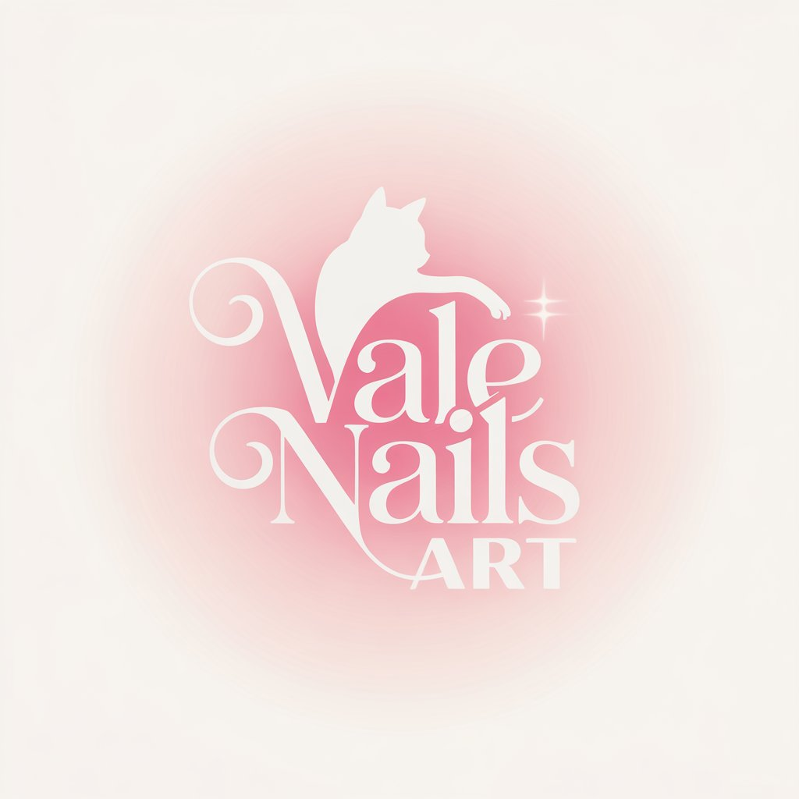

# 💅 Valenn Nails

> **Professional Nail Art Studio** - Modern web application for appointment scheduling, service showcase, and client portfolio with bilingual support

[](https://astro.build/)
[](https://reactjs.org/)
[](https://www.typescriptlang.org/)
[](https://tailwindcss.com/)
[](https://www.framer.com/motion/)
[](https://opensource.org/licenses/MIT)

¡Bienvenid@ a **Valenn Nails**! Este es el sitio web oficial de Valentina Dumont, donde encontrarás arte de uñas profesional, diseños únicos y elegantes, y toda la información sobre servicios de manicura, pedicura, nail art, gelish y extensiones.

## ✨ Características principales

- 🎨 **Galería interactiva** - Showcase de trabajos profesionales con lazy loading
- 🌍 **Multilenguaje** - Soporte completo para español e inglés
- 🌓 **Modo claro/oscuro** - Experiencia visual adaptable
- 📱 **Diseño responsive** - Optimizado para todos los dispositivos
- ⚡ **Rendimiento optimizado** - Carga rápida con Astro y técnicas modernas
- 🎪 **Animaciones suaves** - Transiciones elegantes con Framer Motion
- 🔧 **Scrollbar personalizada** - Detalles de diseño únicos

## 🚀 Stack tecnológico

| Tecnología | Versión | Propósito |
|------------|---------|-----------|
| **Astro** | 4.0+ | Framework principal y SSG |
| **React** | 18+ | Componentes interactivos |
| **TypeScript** | 5.0+ | Tipado estático y desarrollo robusto |
| **TailwindCSS** | 3.0+ | Estilos y utilidades CSS |
| **Framer Motion** | 11+ | Animaciones y transiciones |

---

## 📁 Estructura del proyecto

```
valenn-nails/
├── public/                # Imágenes públicas y assets
├── src/
│   ├── assets/            # Imágenes y videos internos
│   ├── components/        # Componentes React y Astro
│   ├── contexts/          # Contextos globales (idioma, tema)
│   ├── hooks/             # Custom hooks
│   ├── layouts/           # Layouts Astro
│   ├── pages/             # Páginas principales
│   └── utils/             # Utilidades y helpers
├── astro.config.mjs       # Configuración Astro
├── tailwind.config.mjs    # Configuración Tailwind
├── tsconfig.json          # Configuración TypeScript
├── package.json           # Dependencias y scripts
└── LICENSE                # Licencia MIT
```

---

## 🛠️ Comandos disponibles

| Comando | Descripción | Puerto/Output |
|---------|-------------|---------------|
| `npm install` | Instala todas las dependencias del proyecto | - |
| `npm run dev` | Inicia servidor de desarrollo con hot reload | `localhost:4321` |
| `npm run build` | Compila el sitio estático para producción | `./dist` |
| `npm run preview` | Previsualiza el sitio compilado localmente | `localhost:4321` |
| `npm run astro` | Ejecuta comandos CLI de Astro | - |

---

## 🚀 Inicio rápido

```bash
# Clonar el repositorio
git clone https://github.com/zGIKS/valenn-nails.git

# Navegar al directorio
cd valenn-nails

# Instalar dependencias
npm install

# Iniciar servidor de desarrollo
npm run dev
```

Abre [http://localhost:4321](http://localhost:4321) en tu navegador para ver el sitio.

## 📦 Despliegue

### Compilación para producción

```bash
npm run build
```

Los archivos compilados se generarán en el directorio `dist/` listos para servir desde cualquier hosting estático.


## 🛡️ Licencia

Este proyecto está licenciado bajo la Licencia MIT - consulta el archivo [LICENSE](./LICENSE) para más detalles.

```
Copyright (c) 2024 Valentina Dumont

Permission is hereby granted, free of charge, to any person obtaining a copy
of this software and associated documentation files...
```

## 🖼️ Vista previa


